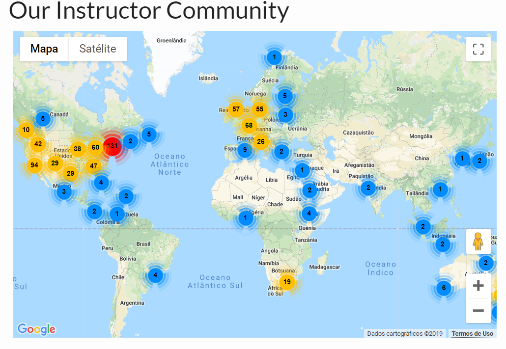
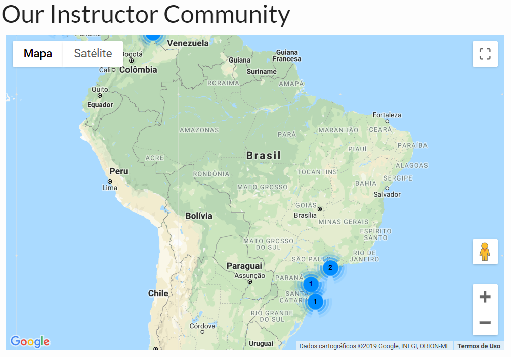

layout: true
  
<div class="my-footer"><span>

Twitter: twitter.com/BeaMilz | beatriz.milz@usp.br | Apresentação em: bit.ly/satRdaySP


</span></div> 

```{r setup, include=FALSE}
options(htmltools.dir.version = FALSE)
```

---
class: slide , middle


# Beatriz Milz

- Doutoranda no Programa de Pós-Graduação em Ciência Ambiental (PROCAM) - Instituto de Energia e Ambiente - Universidade de São Paulo

  - Bolsita FAPESP - Processo nº 2018/23771-6 
  
  - Projeto Temático FAPESP Macroamb - Processo nº 2015/03804-9 
  
```{r echo=FALSE, out.width="50%", fig.align='center'}
knitr::include_graphics("img/logos_bia.png")
```

- Equipe da Secretaria Executiva  Editorial - [Revista Ambiente & Sociedade](http://scielo.br/asoc)

- Co-organizadora - [R-Ladies São Paulo](https://www.meetup.com/pt-BR/R-Ladies-Sao-Paulo) `r emo::ji("purple_heart")`

- [Currículo disponível neste link](https://beatrizmilz.github.io/resume/resume.pdf)

- Blog e slides: [beatrizmilz.com](https://beatrizmilz.com/)

- Anteriormente:
  - Mestre em Ciências - UNIFESP
  - Bacharel em Gestão Ambiental - EACH/USP


---
class: slide , middle

## The Carpentries 

- Comunidade global que desenvolve e realiza workshops sobre habilidades de programação (principalmente ciência de dados).

- Workshops desenvolvidos pela comunidade!

- Workshops realizados por instrutores que recebem um treinamento e são certificados.

- Tem um [Código de conduta](https://docs.carpentries.org/topic_folders/policies/code-of-conduct.html), sempre sendo discutido e aprimorado!

- Patrocinadores: [disponível aqui](https://carpentries.org/supporters/). Ex: RConsortium, RStudio, entre outros.

---
class: slide , middle

## The Carpentries 

- **Visão**: Nossa visão é ser a **comunidade inclusiva** líder em ensino de dados e habilidades de programação.

- **Missão**: A Carpentries desenvolve capacidade global em dados essenciais e habilidades computacionais para conduzir pesquisas eficientes, abertas e reproduzíveis. Treinamos e promovemos uma **comunidade ativa, inclusiva e diversificada** de alunos e instrutores que promove e modela a importância do software e dos dados na pesquisa. Colaboramos no desenvolvimento de lições abertas e entregamos essas lições usando práticas de ensino baseadas em evidências. Focamos nas pessoas que conduzem e apoiam pesquisas.

Fonte: https://carpentries.org/about/

---
class: slide , middle

## The Carpentries e R


.pull-left[
<br>
```{r echo=FALSE, out.width="60%", fig.align='center'}
knitr::include_graphics(c("img/dc.svg", "img/swc.svg", "img/lc.svg"))
```

- Workshops desenvolvidos pela comunidade!
]

.pull-right[


- **Data Carpentry**

- [Data Analysis and Visualization in R for Ecologists](https://datacarpentry.org/R-ecology-lesson/)

- [Introduction to R for Geospatial Data](https://datacarpentry.org/r-intro-geospatial)

- [Introduction to Geospatial Raster and Vector Data with R](https://datacarpentry.org/r-raster-vector-geospatial)

- **Software Carpentry**

- [Programming with R](http://swcarpentry.github.io/r-novice-inflammation)

- [R for Reproducible Scientific Analysis](http://swcarpentry.github.io/r-novice-gapminder)

- **Library Carpentry**

- [Introduction to R](https://librarycarpentry.org/lc-r/)


]

---
class: slide , middle

## Instrutores - Mundo

```{r echo=FALSE, out.width="90%", fig.align='center'}

```

Fonte: https://carpentries.org/instructors-map/
---
class: slide , middle

## Instrutores - Brasil

```{r echo=FALSE, out.width="90%", fig.align='center'}

```

Fonte: https://carpentries.org/instructors-map/

---
class: slide , middle

## Treinamento de instrutor(a)

1. [Preencher o formulário de interesse](https://amy.carpentries.org/forms/request_training/)

2. Receber email com o link para agendar o treinamento.

3. Fazer o treinamento - 2 dias, online, em inglês.

4. Checkout Process: 

  4.1 Contribuir com um workshop, através do GitHub
 
  4.2 Participar de uma discussão online (community discussion)
  
  4.3 Live coding demo de 5 minutos.


- [Mais informações aqui](https://carpentries.github.io/instructor-training/)

- Estou devendo um post sobre isso! Mas posso tirar dúvidas.

---
class: slide , middle

## Desafios para a comunidade brasileira

- Treinamento de instrutores/as é em inglês

- Poucos instrutores/instrutoras certificados

- Material do workshop está em inglês 


```{r eval=FALSE, include=FALSE}
+ Instrutores - + Workshops, + Equipe para traduzir, eventualmente equipe de treinamento de instrutores em português
```


---
class: middle  

# Agradecimentos

```{r echo=FALSE, fig.align='center', out.width="50%"}
knitr::include_graphics("https://media1.giphy.com/media/3oz8xIsloV7zOmt81G/giphy.gif")
```

- **Contato**:

  - Email: <a href="mailto:beatriz.milz@usp.br">beatriz.milz@usp.br</a>
  - Webpage: https://beatrizmilz.com
  - Github: <a href="http://github.com/beatrizmilz">@beatrizmilz</a>
  - Twitter: <a href="http://twitter.com/beatrizmilz">@BeaMilz</a> 
  - Linkedin: <a href="https://www.linkedin.com/in/beatrizmilz">Beatriz Milz</a>


- The Carpentries - [Website](https://carpentries.org/), [Twitter](https://twitter.com/thecarpentries), [Facebook](https://www.facebook.com/carpentries/), [LinkedIn](https://www.linkedin.com/company/the-carpentries/), [Slack](https://swc-slack-invite.herokuapp.com/)


- Apresentação feita com [Xaringan](https://github.com/yihui/xaringan).